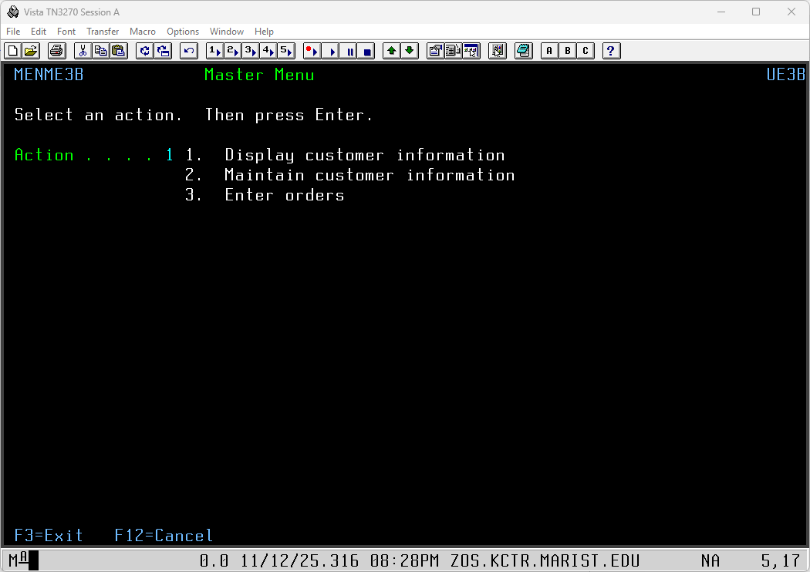
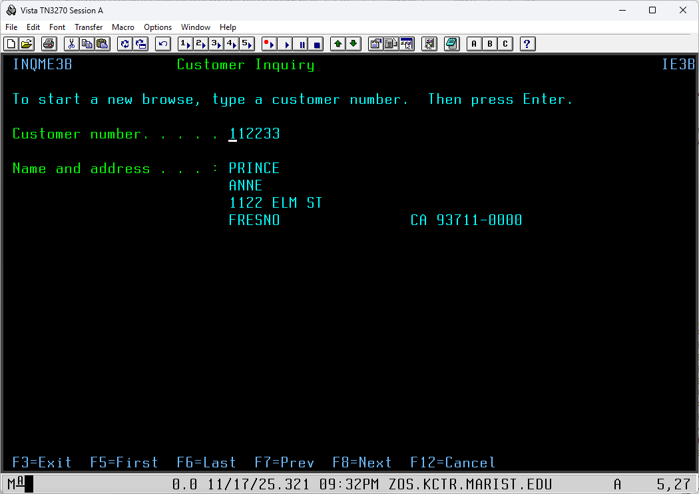
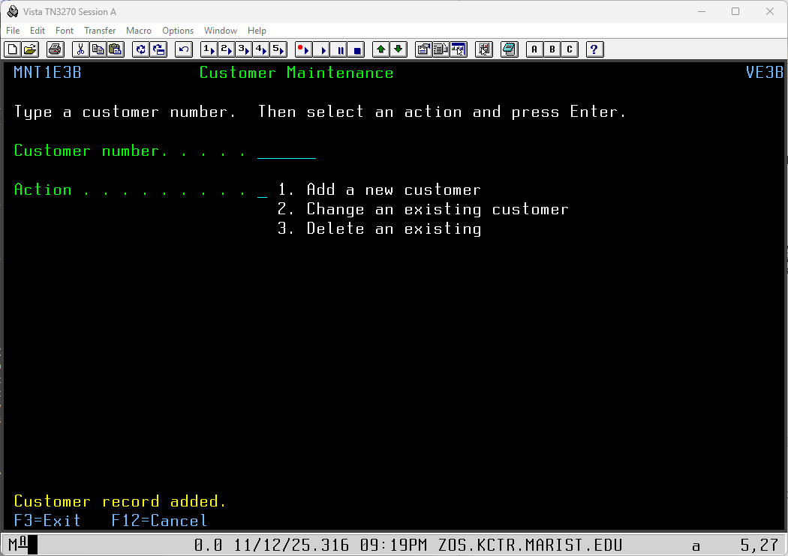
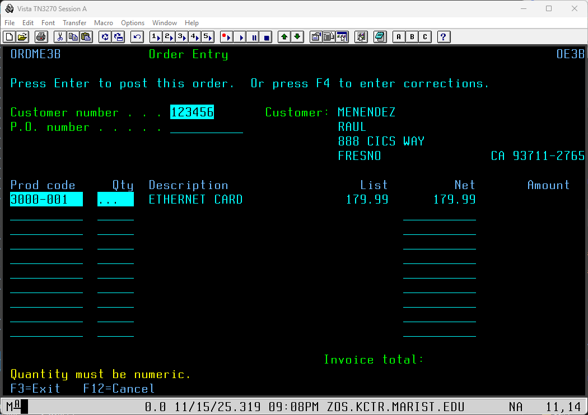
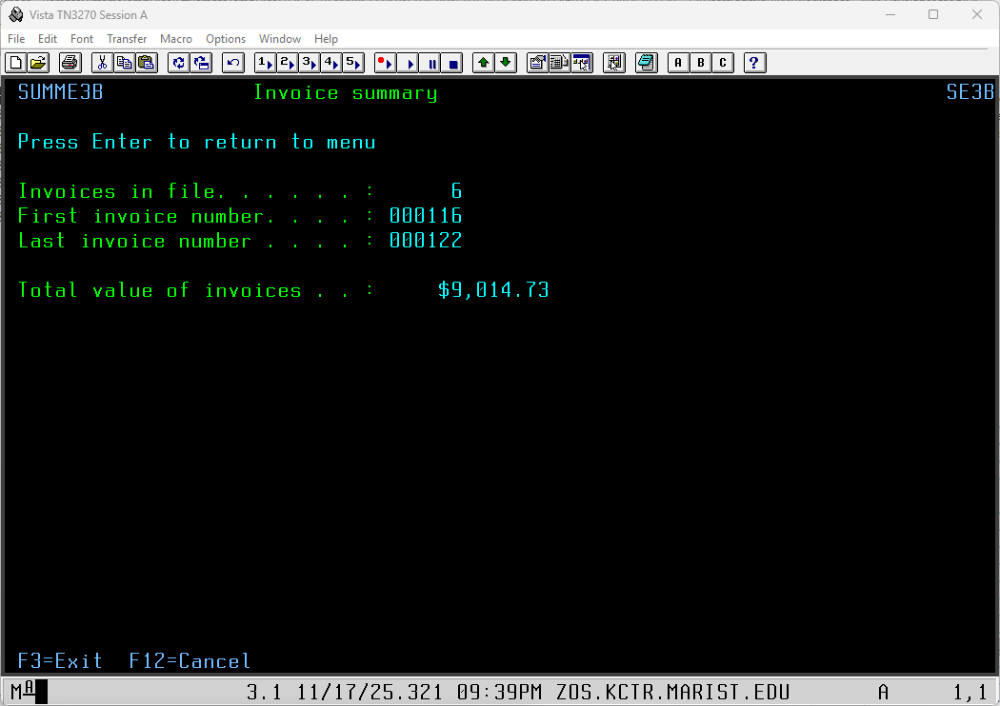

## 📋 COBOL Customer Management System

I developed a comprehensive multi-page COBOL customer management system featuring:

- **Main Navigation Menu** - Central hub for accessing all system modules
- **Customer Lookup** - Search functionality with input validation to locate customer records
- **Full Customer Maintenance** - Complete CRUD operations (Create, Read, Update, Delete) for customer data
- **Order Entry Module** - Ability to edit existing orders or create new order entries
- **Invoice Summary Page** - Automated calculation of totals and display of key invoice values

This project demonstrates proficiency in COBOL programming, file handling, data validation, menu-driven navigation, and business logic implementation for a real-world application scenario.

## ⚠️ Academic Integrity Notice

Due to Durham college's academic code of conduct, I cannot share the complete COBOL source code for this project as it may still be used in current coursework. Sharing full solutions would violate academic integrity policies and could facilitate plagiarism.

However, I have included:
- **Screenshots** demonstrating the working program and its output

## 📸 Screenshots

### Menu Navigation

  
  
<em>Main navigation menu providing access to all system modules</em>

### Customer Lookup

  
  
<em>Customer search functionality with input validation to locate customer records</em>

### Add Customer Record

  
  
<em>Customer maintenance screen for creating new customer entries</em>

### System Testing

  
  
<em>Test case demonstrating data validation and error handling</em>

### Invoice Summary

  
  
<em>Invoice summary page displaying automated calculations and key invoice values</em>

In future updates, I plan to share code snippets and partial implementations that showcase my work while respecting academic integrity guidelines.

Thank you for understanding my commitment to ethical academic practices.