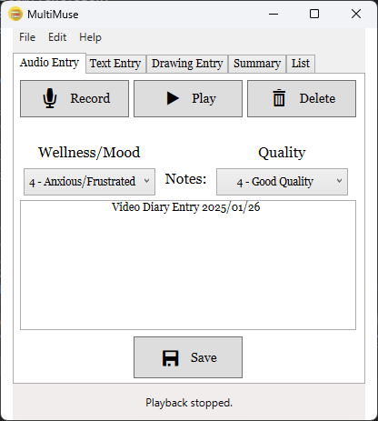
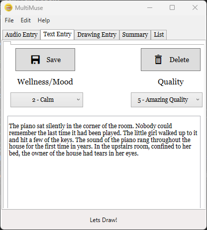
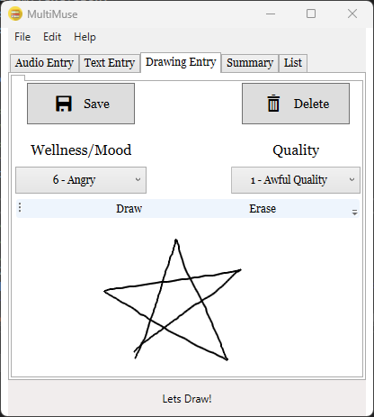

# SketchLabs 🎨🎙️✍️

Your all-in-one digital creative studio! SketchLabs is a C# and WPF desktop application that transforms how you document your creative process—seamlessly blending drawings, written ideas, and audio recordings into one unified, trackable creative journal.

## ✨ Features

- **Multi-Format Content** - Create and store drawings, written notes, and audio recordings
- **Local Database Storage** - Persistent storage of all creative content
- **Progress Tracking** - Dated entries with status updates, personalized notes, and a rating system
- **Intuitive Interface** - Built with WPF for seamless navigation between content types

## 📸 Screenshots

### Record Screen

  
  
<em>Audio recording interface for capturing voice memos and reflections</em>

### Text Screen

  
  
<em>Written content editor for notes, ideas, and journal entries</em>

### Draw Screen

  
  
<em>Digital drawing canvas for sketches and creative artwork</em>

