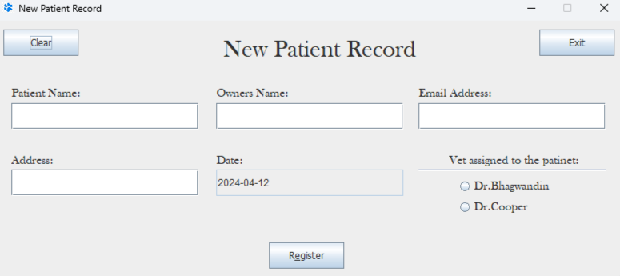

# Veterinarian Patient Form

A Java Swing GUI application for managing veterinary patient registrations. This desktop application provides an intuitive interface for recording patient information, owner details, and assigned veterinarians.

## 📋 Overview

This project was developed as part of my coursework to demonstrate proficiency in Java GUI development, event handling, file I/O operations, and form validation. The application streamlines the patient registration process for veterinary clinics.

Through this project, I gained hands-on experience with object-oriented programming principles and design patterns, event-driven programming with ActionListeners for interactive components, form validation and comprehensive error handling mechanisms, file I/O operations for persistent data storage, GUI layout design with absolute positioning for responsive interfaces, and the ButtonGroup pattern for managing mutually exclusive radio button selections.

## 📝 Sample Output

Patient records are saved to `patientForms.txt`

### This is also a screenshot of what it looks like: 

  
  
<em>Customize your gaming experience</em>

*This project was created as part of academic coursework to demonstrate Java GUI development capabilities.*